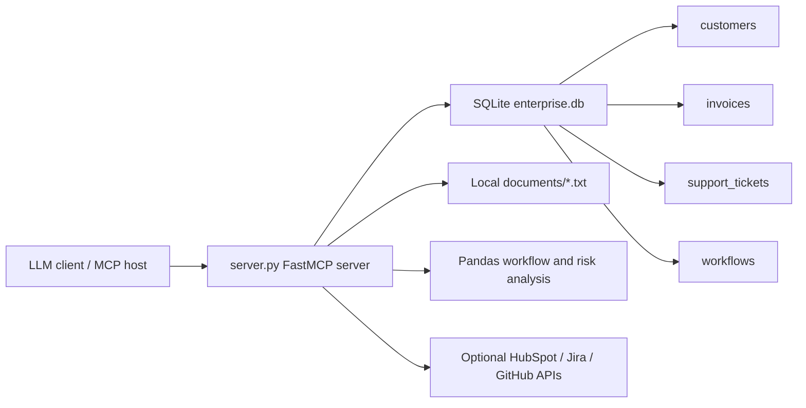

# enterprise-mcp-agent

`enterprise-mcp-agent` is a local Model Context Protocol server that exposes realistic enterprise business data, document search, workflow analysis, CRM context, ticket context, and repository-risk tools to an LLM client. It is self-contained by default: data lives in SQLite, documents live in local text files, and analysis uses Pandas. Optional HubSpot, Jira, and GitHub tools can call live APIs when credentials are configured.

## Architecture



## What It Provides

- `query_business_database(question: str)`: maps common business questions to generated safe read-only SQL and returns a natural-language answer with tabular evidence.
- `generate_read_only_sql(question: str)`: generates SQL from a natural-language question and validates it with the read-only SQL guard.
- `search_documents(query: str)`: searches local text files through a local vector-style index and returns ranked snippets.
- `analyse_workflows(department: str | None)`: ranks automation candidates by estimated monthly manual hours.
- `generate_risk_report(customer_name: str)`: combines customer risk, invoice exposure, support tickets, and document findings into a structured report.
- `get_customer_from_hubspot(customer_name: str)`: fetches CRM company context from HubSpot, with a demo fallback when credentials are absent.
- `get_open_jira_tickets_for_customer(customer_name: str | None, priority: str | None)`: fetches unresolved Jira tickets, with a demo fallback when credentials are absent.
- `analyse_repository_risk(owner_repo: str | None)`: uses the GitHub API to summarize open issues, pull requests, contributors, and repository risk.
- `find_customers_with_overdue_invoices_and_critical_tickets(customer_name: str | None)`: combines local overdue invoice exposure with unresolved critical Jira ticket context.
- `database_stats()`: shows record counts for the seeded synthetic enterprise dataset.
- `run_agent_workflow(goal: str, customer_name: str | None, department: str | None)`: runs a simple multi-step agent workflow that combines tool outputs into recommendations.

## Safeguards

- SQLite is opened locally only.
- SQL execution is restricted to `SELECT`.
- Write or schema-changing commands such as `DROP`, `DELETE`, `UPDATE`, `INSERT`, and `ALTER` are rejected.
- External APIs are optional and only used by the HubSpot, Jira, and GitHub tools when configured or explicitly called.
- Tool failures return clear error messages instead of raw tracebacks.

## Setup

```bash
cd enterprise-mcp-agent
python -m venv .venv
source .venv/bin/activate
pip install -r requirements.txt
python server.py
```

The database is created and seeded automatically on first run as `enterprise.db`.

## Dashboard

Run the Streamlit dashboard:

```bash
streamlit run dashboard.py
```

It shows customer counts, invoice exposure, risk and revenue views, and workflow automation candidates.

## Optional API Integrations

The project works without credentials. HubSpot and Jira tools return realistic demo fallback data until you configure live API access. GitHub can call the public GitHub API and can use `GITHUB_TOKEN` for higher rate limits.

```bash
# HubSpot private app token
export HUBSPOT_ACCESS_TOKEN="pat-na1-..."

# Jira Cloud
export JIRA_BASE_URL="https://your-domain.atlassian.net"
export JIRA_EMAIL="you@example.com"
export JIRA_API_TOKEN="..."
export JIRA_PROJECT_KEY="ENT"

# GitHub
export GITHUB_TOKEN="ghp_..."
export GITHUB_REPOSITORY="Nikithaxx05/enterprise-mcp-agent"
```

## Upgraded Features

- LLM-style SQL generation: natural-language questions are converted into SQL through a safe generator layer. The default implementation is offline, so no external API calls are made. Any generated SQL still passes the read-only guard before execution.
- Vector database path: document search now uses a local vector-style TF-IDF/cosine index. `chromadb` and `faiss-cpu` are listed as optional vector backends in `pyproject.toml` for production-style replacement.
- 50k+ synthetic records: the seeder creates 50,000 customers plus related invoice, support ticket, and workflow records.
- Streamlit dashboard: `dashboard.py` provides a visual interface over the enterprise dataset.
- Enterprise API integrations: optional HubSpot, Jira, and GitHub tools make the demo feel like a realistic enterprise agent stack.
- Agent workflow: `run_agent_workflow` chains risk reporting, HubSpot CRM context, Jira tickets, document retrieval, workflow analysis, and GitHub delivery risk into one recommendation flow.

## MCP Client Configuration

Use the server as a local stdio MCP server. A typical client configuration looks like this:

```json
{
  "mcpServers": {
    "enterprise-mcp-agent": {
      "command": "python",
      "args": ["/absolute/path/to/enterprise-mcp-agent/server.py"]
    }
  }
}
```

Replace the path with the location of this project on your machine.

## Example Prompts

- Which customers have the highest risk scores?
- Show overdue invoices by customer.
- Search documents for compliance requirements related to healthcare customers.
- Analyse workflows for the Finance department.
- Generate a risk report for Atlas Energy Partners.
- Get the HubSpot CRM record for Atlas Energy Partners.
- Show unresolved critical Jira tickets for Atlas Energy Partners.
- Which customers have overdue invoices and unresolved critical tickets?
- Analyse GitHub repository risk for Nikithaxx05/enterprise-mcp-agent.

More examples are in `examples/demo_prompts.md`.

## Dataset Scale

Output from `database_stats()`:

```text
Enterprise dataset scale:

| table_name | record_count |
| --- | --- |
| customers | 50000 |
| invoices | 60010 |
| support_tickets | 40010 |
| workflows | 508 |
```

## Example Inputs and Outputs

These examples were generated by running the local tool functions against the seeded SQLite database and local document files.

### `query_business_database`

Input:

```text
Show overdue invoices by customer
```

Output:

````text
Overdue invoice exposure by customer:

Generated SQL:
```sql
SELECT c.name AS customer, i.amount, i.status, i.due_date
FROM invoices i
JOIN customers c ON c.id = i.customer_id
WHERE i.status = 'overdue'
ORDER BY i.amount DESC
LIMIT 10
```

| customer | amount | status | due_date |
| --- | --- | --- | --- |
| Atlas Energy Partners | 310000.0 | overdue | 2026-05-08 |
| Northstar Networks 17437 | 239974.0 | overdue | 2026-04-19 |
| Northstar Logistics 12877 | 239965.0 | overdue | 2026-05-01 |
| BluePeak Networks 14938 | 239958.0 | overdue | 2026-04-20 |
| Cedar Networks 34639 | 239948.0 | overdue | 2026-06-06 |
````

### `generate_read_only_sql`

Input:

```text
count records by table
```

Output:

````text
Generated read-only SQL for record counts:

```sql
SELECT 'customers' AS table_name, COUNT(*) AS record_count FROM customers
UNION ALL
SELECT 'invoices', COUNT(*) FROM invoices
UNION ALL
SELECT 'support_tickets', COUNT(*) FROM support_tickets
UNION ALL
SELECT 'workflows', COUNT(*) FROM workflows
```
````

### `search_documents`

Input:

```text
invoice automation
```

Output:

```text
Relevant local document snippets:

- operations_review.txt (score 0.185): Finance teams spend the most time on invoice follow-up, dispute triage, and payment-status reporting. High-volume manual work is a strong candidate for automation when the work is frequent, rule-based, and tied to measurable cycle time.

- operations_review.txt (score 0.165): Operations teams identified approval workflows, monthly reporting, and vendor coordination as repeatable processes with high automation potential.

- security_and_compliance.txt (score 0.131): Acme Manufacturing requires SOC 2 evidence for invoice-processing integrations and wants an exportable audit log for finance approvals.
```

### `analyse_workflows`

Input:

```text
Finance
```

Output:

```text
Automation recommendations ranked by impact:

1. Finance - Invoice dispute triage
   Impact score: 630.0 hours/month
   Manual steps: 7; average time: 45 minutes; frequency: 120/month
   Recommendation: Automate 'Invoice dispute triage' with rules, routing, and status updates; estimated impact is 630.0 manual hours/month.

2. Finance - Payment status reporting
   Impact score: 225.0 hours/month
   Manual steps: 5; average time: 30 minutes; frequency: 90/month
   Recommendation: Automate 'Payment status reporting' with rules, routing, and status updates; estimated impact is 225.0 manual hours/month.
```

### `generate_risk_report`

Input:

```text
Atlas Energy Partners
```

Output:

```text
# Risk Report: Atlas Energy Partners

- Industry: Energy
- Annual revenue: $65,000,000
- Risk score: 84 (High)
- Open invoice exposure: $450,000
- Overdue invoice exposure: $310,000
- Support tickets: {'open': 2}
- High-priority open tickets: 2

## Recommended Actions
- Prioritize finance follow-up for overdue invoices and confirm dispute status.
- Escalate high-priority open support issues with named owners and target resolution dates.
- Start executive-level retention review because the customer is in the high-risk band.

## Document Findings
- customer_success_notes.txt: Atlas Energy Partners is under renewal review. Account notes mention aging unpaid invoices, field-service integration delays, and a request for clearer incident escalation reporting.
- security_and_compliance.txt: Atlas Energy Partners flagged vendor risk concerns related to delayed integrations and inconsistent escalation notes.
```

### `run_agent_workflow`

Input:

```text
goal="prioritize finance automation and risk", customer_name="Atlas Energy Partners", department="Finance"
```

Output excerpt:

```text
Goal: prioritize finance automation and risk

## Agent Plan
1. Inspect relevant structured data.
2. Retrieve document evidence.
3. Analyse workflow automation impact.
4. Combine findings into next actions.

## Customer Risk
# Risk Report: Atlas Energy Partners

- Risk score: 84 (High)
- Open invoice exposure: $450,000
- Overdue invoice exposure: $310,000

## HubSpot CRM Context
HubSpot customer record:

- source: Demo fallback because HUBSPOT_ACCESS_TOKEN is not configured
- company: Atlas Energy Partners
- lifecycle_stage: Customer

## Jira Ticket Context
Open Jira tickets:

- ENT-1842 [Critical / In Progress]: Critical integration outage blocking renewal validation

## Workflow Analysis
Automation recommendations ranked by impact:
```

## Why This Matters

Enterprise AI agents need controlled access to business systems, private documents, and workflow context. MCP provides a clean boundary between an LLM client and enterprise tools. This project demonstrates:

- Enterprise data access through read-only structured queries.
- Retrieval-augmented generation using local document snippets.
- Workflow automation discovery with measurable impact ranking.
- Customer risk reporting that combines database records and document evidence.
- A practical pattern for exposing business context without sending data to external APIs.
