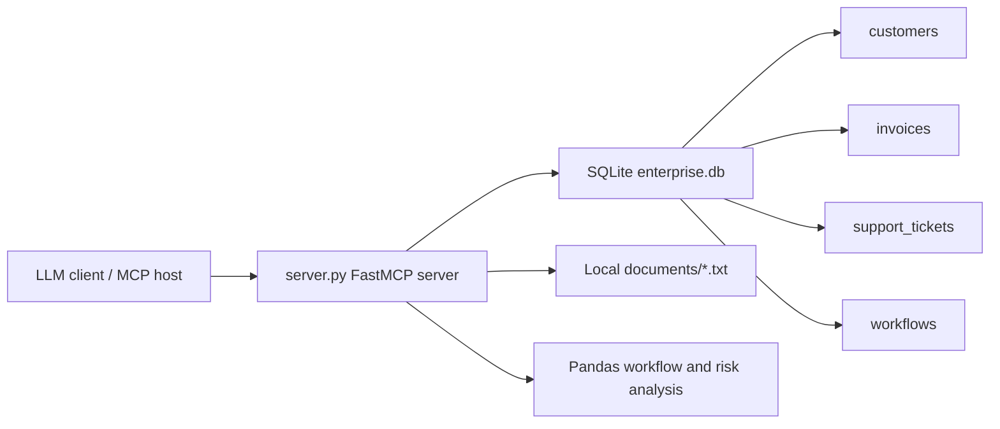

# enterprise-mcp-agent

`enterprise-mcp-agent` is a local Model Context Protocol server that exposes realistic enterprise business data, document search, and workflow analysis tools to an LLM client. It is intentionally self-contained: data lives in SQLite, documents live in local text files, analysis uses Pandas, and no external API calls are made.

## Architecture



## What It Provides

- `query_business_database(question: str)`: maps common business questions to safe read-only SQL and returns a natural-language answer with tabular evidence.
- `search_documents(query: str)`: searches local text files and returns ranked snippets.
- `analyse_workflows(department: str | None)`: ranks automation candidates by estimated monthly manual hours.
- `generate_risk_report(customer_name: str)`: combines customer risk, invoice exposure, support tickets, and document findings into a structured report.

## Safeguards

- SQLite is opened locally only.
- SQL execution is restricted to `SELECT`.
- Write or schema-changing commands such as `DROP`, `DELETE`, `UPDATE`, `INSERT`, and `ALTER` are rejected.
- The implementation does not call external APIs.
- Tool failures return clear error messages instead of raw tracebacks.

## Setup

```bash
cd enterprise-mcp-agent
python -m venv .venv
source .venv/bin/activate
pip install -r requirements.txt
python server.py
```

The database is created and seeded automatically on first run as `enterprise.db`.

## MCP Client Configuration

Use the server as a local stdio MCP server. A typical client configuration looks like this:

```json
{
  "mcpServers": {
    "enterprise-mcp-agent": {
      "command": "python",
      "args": ["/absolute/path/to/enterprise-mcp-agent/server.py"]
    }
  }
}
```

Replace the path with the location of this project on your machine.

## Example Prompts

- Which customers have the highest risk scores?
- Show overdue invoices by customer.
- Search documents for compliance requirements related to healthcare customers.
- Analyse workflows for the Finance department.
- Generate a risk report for Atlas Energy Partners.

More examples are in `examples/demo_prompts.md`.

## Why This Matters

Enterprise AI agents need controlled access to business systems, private documents, and workflow context. MCP provides a clean boundary between an LLM client and enterprise tools. This project demonstrates:

- Enterprise data access through read-only structured queries.
- Retrieval-augmented generation using local document snippets.
- Workflow automation discovery with measurable impact ranking.
- Customer risk reporting that combines database records and document evidence.
- A practical pattern for exposing business context without sending data to external APIs.
