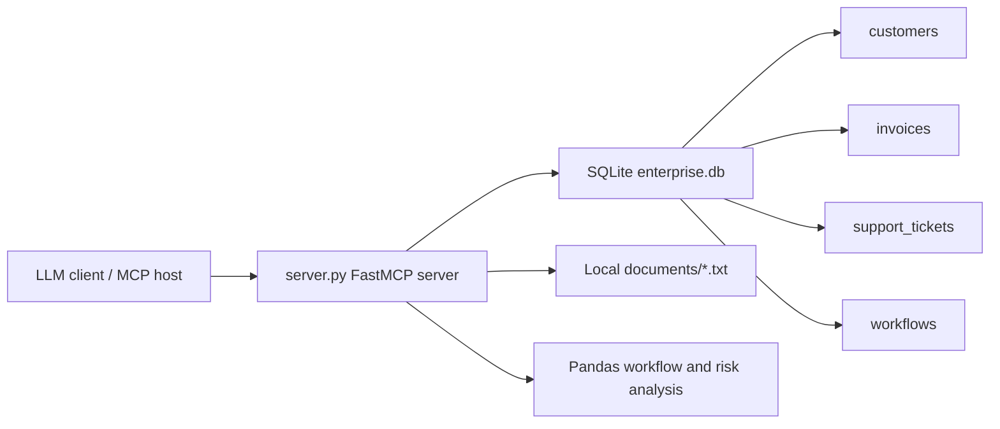

# enterprise-mcp-agent

`enterprise-mcp-agent` is a local Model Context Protocol server that exposes realistic enterprise business data, document search, and workflow analysis tools to an LLM client. It is intentionally self-contained: data lives in SQLite, documents live in local text files, analysis uses Pandas, and no external API calls are made.

## Architecture



## What It Provides

- `query_business_database(question: str)`: maps common business questions to safe read-only SQL and returns a natural-language answer with tabular evidence.
- `search_documents(query: str)`: searches local text files and returns ranked snippets.
- `analyse_workflows(department: str | None)`: ranks automation candidates by estimated monthly manual hours.
- `generate_risk_report(customer_name: str)`: combines customer risk, invoice exposure, support tickets, and document findings into a structured report.

## Safeguards

- SQLite is opened locally only.
- SQL execution is restricted to `SELECT`.
- Write or schema-changing commands such as `DROP`, `DELETE`, `UPDATE`, `INSERT`, and `ALTER` are rejected.
- The implementation does not call external APIs.
- Tool failures return clear error messages instead of raw tracebacks.

## Setup

```bash
cd enterprise-mcp-agent
python -m venv .venv
source .venv/bin/activate
pip install -r requirements.txt
python server.py
```

The database is created and seeded automatically on first run as `enterprise.db`.

## MCP Client Configuration

Use the server as a local stdio MCP server. A typical client configuration looks like this:

```json
{
  "mcpServers": {
    "enterprise-mcp-agent": {
      "command": "python",
      "args": ["/absolute/path/to/enterprise-mcp-agent/server.py"]
    }
  }
}
```

Replace the path with the location of this project on your machine.

## Example Prompts

- Which customers have the highest risk scores?
- Show overdue invoices by customer.
- Search documents for compliance requirements related to healthcare customers.
- Analyse workflows for the Finance department.
- Generate a risk report for Atlas Energy Partners.

More examples are in `examples/demo_prompts.md`.

## Example Inputs and Outputs

These examples were generated by running the local tool functions against the seeded SQLite database and local document files.

### `query_business_database`

Input:

```text
Show overdue invoices by customer
```

Output:

```text
Overdue invoice exposure by customer:

| customer | amount | status | due_date |
| --- | --- | --- | --- |
| Atlas Energy Partners | 310000.0 | overdue | 2026-05-08 |
| Acme Manufacturing | 125000.0 | overdue | 2026-05-21 |
| Summit Financial | 66000.0 | overdue | 2026-06-02 |
```

### `search_documents`

Input:

```text
invoice automation
```

Output:

```text
Relevant local document snippets:

- operations_review.txt (score 2): Finance teams spend the most time on invoice follow-up, dispute triage, and payment-status reporting. High-volume manual work is a strong candidate for automation when the work is frequent, rule-based, and tied to measurable cycle time.

- customer_success_notes.txt (score 1): Acme Manufacturing requested automated invoice reminders after two late payments in the last quarter. Their finance team cited manual reconciliation and missing purchase order references as recurring friction.

- customer_success_notes.txt (score 1): Vertex Retail Co. reported that store managers spend several hours each week consolidating stock transfer approvals. The operations team asked for workflow automation around exception approvals and vendor backorder notifications.
```

### `analyse_workflows`

Input:

```text
Finance
```

Output:

```text
Automation recommendations ranked by impact:

1. Finance - Invoice dispute triage
   Impact score: 630.0 hours/month
   Manual steps: 7; average time: 45 minutes; frequency: 120/month
   Recommendation: Automate 'Invoice dispute triage' with rules, routing, and status updates; estimated impact is 630.0 manual hours/month.

2. Finance - Payment status reporting
   Impact score: 225.0 hours/month
   Manual steps: 5; average time: 30 minutes; frequency: 90/month
   Recommendation: Automate 'Payment status reporting' with rules, routing, and status updates; estimated impact is 225.0 manual hours/month.
```

### `generate_risk_report`

Input:

```text
Atlas Energy Partners
```

Output:

```text
# Risk Report: Atlas Energy Partners

- Industry: Energy
- Annual revenue: $65,000,000
- Risk score: 84 (High)
- Open invoice exposure: $450,000
- Overdue invoice exposure: $310,000
- Support tickets: {'open': 2}
- High-priority open tickets: 2

## Recommended Actions
- Prioritize finance follow-up for overdue invoices and confirm dispute status.
- Escalate high-priority open support issues with named owners and target resolution dates.
- Start executive-level retention review because the customer is in the high-risk band.

## Document Findings
- customer_success_notes.txt: Atlas Energy Partners is under renewal review. Account notes mention aging unpaid invoices, field-service integration delays, and a request for clearer incident escalation reporting.
- security_and_compliance.txt: Atlas Energy Partners flagged vendor risk concerns related to delayed integrations and inconsistent escalation notes.
```

## Why This Matters

Enterprise AI agents need controlled access to business systems, private documents, and workflow context. MCP provides a clean boundary between an LLM client and enterprise tools. This project demonstrates:

- Enterprise data access through read-only structured queries.
- Retrieval-augmented generation using local document snippets.
- Workflow automation discovery with measurable impact ranking.
- Customer risk reporting that combines database records and document evidence.
- A practical pattern for exposing business context without sending data to external APIs.
